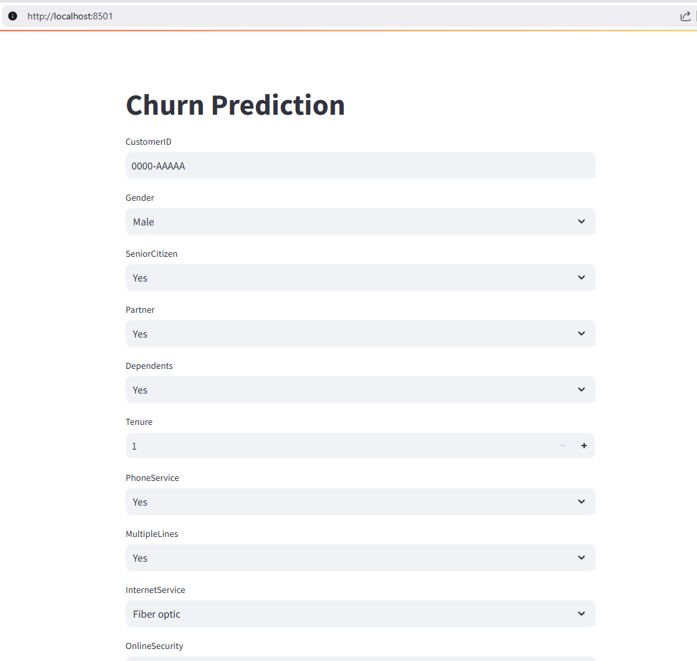
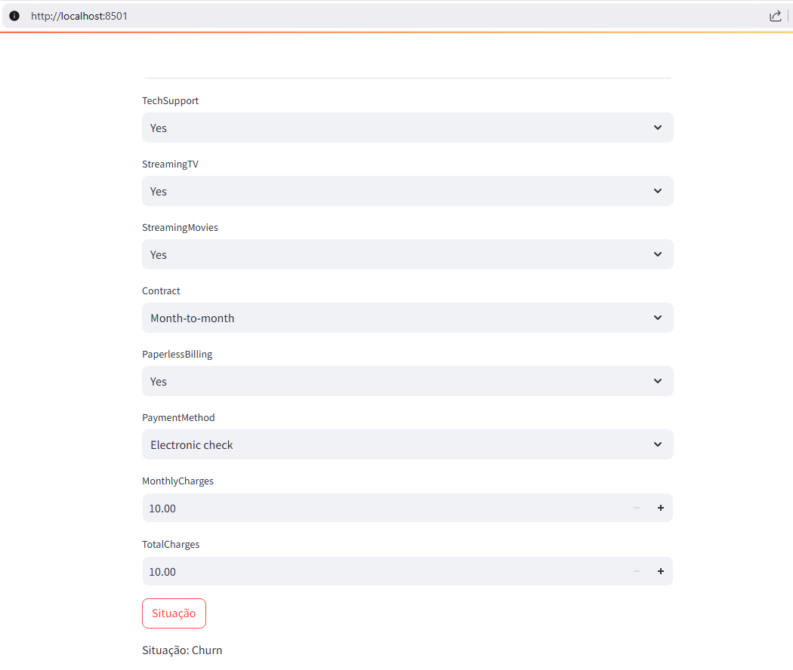

# Prever Churn de clientes em Telecomunicação

## Sumário

- Descrição do Problema
- Objetivo do Projeto
- Solução
- Imagens do Projetos (EDA, Treino, Avaliação e Deploy básico com Streamlit)

Link direto para o notebook do projeto: [churn_modeling](https://github.com/idfelipemalatesta/telecom-churn-prediction/blob/main/notebooks/churn_modeling.ipynb)

## Descrição do Problema

O setor de telecomunicações está em constante evolução para atender às demandas dos consumidores. Com o avanço da tecnologia e a mudança no comportamento dos usuários, as operadoras enfrentam desafios que podem impactar o sucesso dos negócios. Para se manterem competitivas, é crucial que as empresas analisem regularmente seus dados para identificar problemas e oportunidades de melhoria.

Os dados utilizados neste projeto foram disponibilizados pela plataforma de ensino da IBM Developer e podem ser encontrados atráves do link a seguir [datasets](https://raw.githubusercontent.com/carlosfab/dsnp2/master/datasets/WA_Fn-UseC_-Telco-Customer-Churn.csv).

## Objetivo do Projeto

Desenvolver um modelo de Machine Learning capaz de prever quais clientes provavelmente abandonarão o serviço. A previsão de rotatividade é um problema crítico para empresas que operam em um modelo de assinatura ou receita recorrente, como as de telecomunicações.

Reduzir o número de falsos negativos e aumentar a presença de verdadeiros positivos resultará em um saldo positivo para a empresa, conforme explicado na solução abaixo.

## Solução

No campo de Machine Learning, utilizamos métricas para avaliar a performance do modelo. Para este projeto, a métrica **recall** é de suma importância, pois analisa o erro do modelo nos clientes que já cancelaram o serviço anteriormente.

- **Verdadeiros Positivos:** Clientes que o modelo previu corretamente que irão cancelar e realmente cancelaram. Essa análise pode ajudar a prevenir cancelamentos futuros.
- **Falsos Negativos:** Clientes que o modelo não conseguiu prever o cancelamento, resultando em perda de receita. O objetivo é selecionar um modelo que consiga identificar e reduzir esses casos.

**Entregáveis:** Um relatório analítico em Excel contendo: valor da fatura mensal, desconto, valor da fatura com desconto, Churn e previsão.

**O modelo identifica corretamente 82% dos clientes que cancelaram o serviço.**

## Imagens do Projeto

Distribuição da Variável Target e Variáveis Categóricas: 

Distribuição das Variáveis Numéricas: 

Desempenho dos Modelos: 

Métricas ROC AUC e Precision Recall: 

Matriz de Confusão: 

Deploy com Streamlit: 

