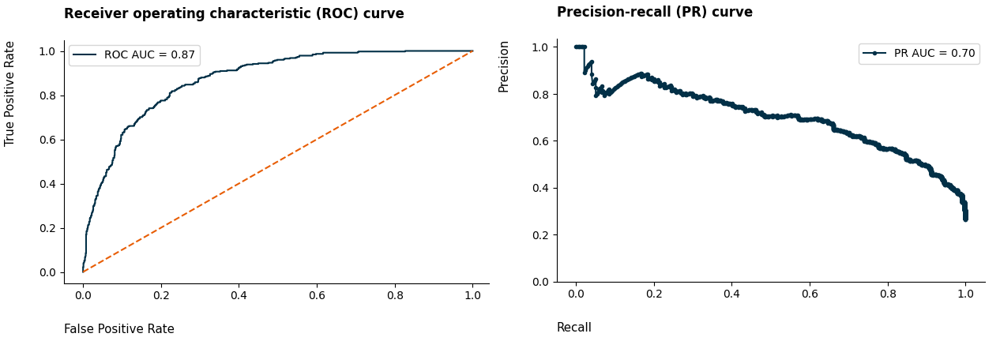

# Prever Churn de clientes em Telecomunicação

## Descrição do Problema

O setor de telecomunicações é um setor em rápido crescimento que está em constante evolução para atender às demandas dos consumidores. À medida que a tecnologia avança e o comportamento do usuário muda, as operadoras de telecomunicações enfrentam uma variedade de desafios que podem impactar o sucesso de seus negócios. Para permanecerem competitivas e atender às necessidades dos clientes, é importante que as empresas de telecomunicações analisem regularmente seus dados para identificar problemas relevantes e oportunidades de melhoria.

Os dados utilizados neste projeto foram originalmente disponibilizados na [plataforma de ensino da IBM Developer](https://developer.ibm.com/technologies/data-science/). O dataset completo pode ser encontrado neste [link](https://raw.githubusercontent.com/carlosfab/dsnp2/master/datasets/WA_Fn-UseC_-Telco-Customer-Churn.csv).

## Objetivo do Projeto

O objetivo é desenvolver um modelo de Machine Learning que possa prever quais clientes provavelmente abandonarão ou descontinuarão o uso do serviço. A previsão de rotatividade é um problema comercial crítico para empresas que operam em um modelo de assinatura ou receita recorrente, como empresas de telecomunicações.

Diminuir o número de falsos negativos e aumentar a presença de verdadeiros positivos resultará em um saldo positivo para a empresa, explico na solução abaixo.

## Solução

Na área de Machine Learning temos métricas para avaliar a performance do modelo. Para este projeto de previsão de cancelamento de serviço a métrica **recall** é de suma importância. A métrica analisa justamente o erro do modelo nos clientes que já cancelaram o serviço anteriormente.

Os **Verdadeiros Positivos** são os clientes que o modelo treinado com dados históricos previu que irão cancelar e realmente cancelaram. Essa análise pode resultar na prevenção de possíveis clientes que cancelaram seus planos e com isso tentar revertê-los.

Os **Falso Negativos** são os clientes que o modelo treinado com dados históricos não conseguir prever o cancelamento do serviço, resultado em perda do cliente para a empresa e sua receita associada. Selecionar um modelo que consegue identificar e reduzir esses clientes é o objetivo do projeto.

**Entregáveis:** 1 relatório analítico em excel contendo: O valor da fatura mensal, o desconto, o valor da fatura com o desconto, Churn e predict.

Tópicos do projeto:

- Divisão entre os dados de Treinamento e Teste
- Análise Exploratória dos Dados
- Pré-processamento
- Treinamento de 4 modelos com Validação Cruzada Estratificada
- Otimização de Hiperparâmetros para métrica Recall utilizando o Optuna
- Previsão nos dados de Teste
- Avaliação do Desempenho do Modelo e a importância de cada variável
- Conversão de Machine Learning para Resultados Financeiros
- Conclusão

**O modelo identifica corretamente 82% dos clientes que cancelaram o serviço.**

Abaixo segue algumas imagens do projeto. O projeto completo pode ser acessado clicando [aqui](https://github.com/idfelipemalatesta/telecom-churn-prediction/blob/main/notebooks/churn_modeling.ipynb)

Analisando a distribuição da variável Churn: 

Analisando as variáveis categóricas:

Analisando as variáveis numéricas:

Analisando o desempenho dos modelos:

Analisando as métricas ROC AUC e Precision Recall:

Analisando a matriz de confusão: 

